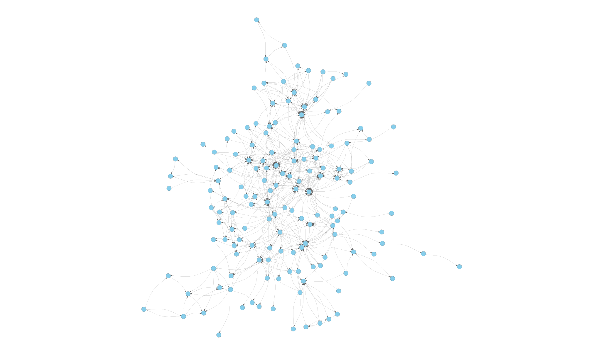

# AGG-PROJ
Repository for AGG2425 project

This project analyzes the import relationships between classes in the JUnit framework using R. It takes an adjacency matrix representing class-level imports and builds a graph using the igraph package. The goal is to visualize and explore how different parts of JUnit are connected through imports.

{ width=50% }
